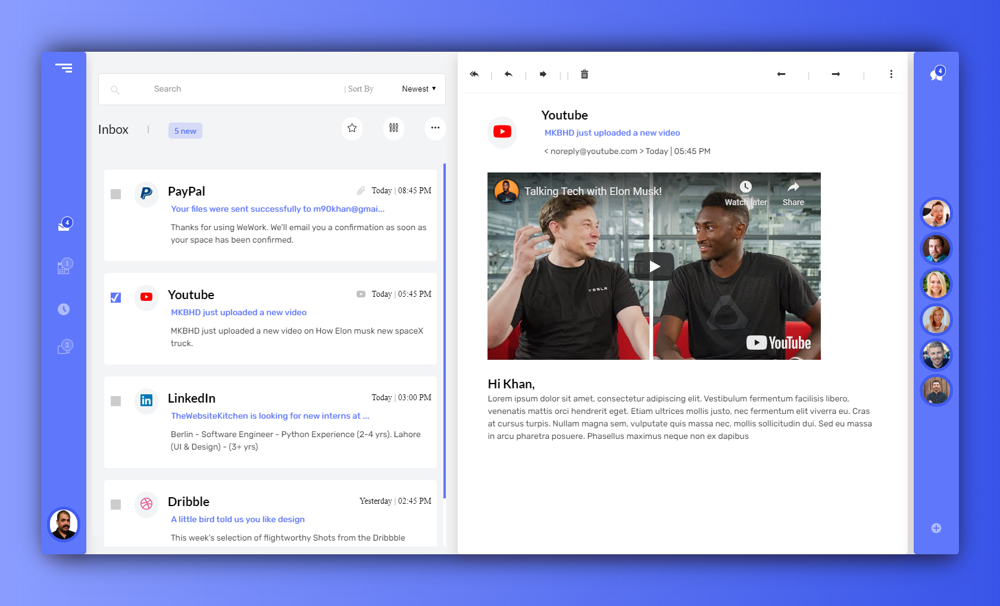

<br />

<p align="center">
  <a href="https://www.thewebsitekitchen.com">
    
  </a>

  <h3 align="center">Mailbox-X | Email WebApp</h3>

  <p align="center">
WebAPP for mails (inspired by GMAIL) <br />
    <a href="m90khan@gmail.com"><strong>Contact Me</strong></a>
    <br />
    <br />
    <a href="m90khan.github.io/mailboxx/">View Demo</a>
    
   </p>
</p>

## Table of Contents

- [About the Project](#about-the-project)
- [Process](#process)
- [Skills](#skills)
- [Code Snippet](#code)
- [Contact](#Contact)

---

### About the Project

Live: https://m90khan.github.io/mailboxx/


#### Process

- Layout the main container
- divide container into 4 sections
- add html for each section
- code css and add a small function for event listener

---

### Skills

- HTML5
- CSS3 - SCSS Syntax
- JavaScript

---

### Code Snippet

```javascript
class InsertData {
  constructor() {
    this.email = document.querySelectorAll(".email-list");
    this.insert = document.querySelector(".email-details");
    this.title = document.querySelector(".details__title");
    this.events();
  }

  events() {
    this.email.forEach((el) => {
      el.addEventListener("click", () => {
        this.insertHTML(el);
      });
    });
  }
  insertHTML(el) {
    const arr = ["PayPal", "Youtube", "LinkedIn", "Dribble"];

    arr.forEach((item) => {
      if (el.children[1].children[0].children[0].innerText === item) {
        this.insert.innerHTML = `     <div class="email-content u-mb-2">
        <div class="icon-box icon-box--dark">
          <svg class="icon-box__icon icon-box__icon--2x">
            <use
              xlink:href="img/sprite.svg#icon-youtube1
          "
            ></use>
          </svg>
        </div>
        <div class="details email-content__header">
          <div class="details__header">
            <h3 class="details__title">${item}</h3>
          </div>
          <div class="details__email">
            <p class="details__subject">
              MKBHD just uploaded a new video
            </p>
            <p class="details__text">
              < noreply@youtube.com >
              <span class="details__date">Today &verbar; 05:45 PM</span>
            </p>
          </div>
        </div>
      </div>
 
    `;
      }
    });
  }
}

new InsertData();
```

---

### Contact

Reach out to me at one of the following places!

- Website : <a href="https://thewebsitekitchen.com" target="_blank">`thewebsitekitchen.com`</a>
- Linkedin : <a href="https://de.linkedin.com/in/khanmohsinx" target="_blank">`khanmohsinx`</a>

---
